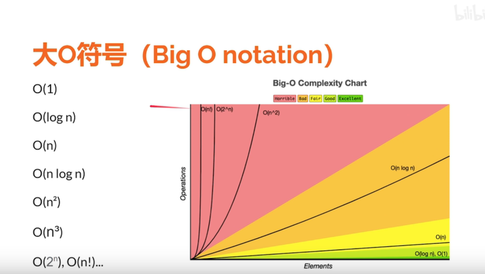

# 刷题预备知识-JavaScript

[TOC]

## 1. 时间复杂度

判断一个算法所编程序运行时间的多少，时间复杂度一般采用大O符号来表示，常见的时间复杂度如下：



### 1.1 常见的时间复杂度

**时间复杂度为O(1)的例子**

```
if条件判断、赋值（result = n*2 ）、array.push()、array.pop()、map.set()、map.get()
```

在计算时间复杂度的时候，O(1)一般会被忽略

**时间复杂度为O(n)的例子**

for循环或者while循环（只有一个循环，不进行循环嵌套，不使用二分搜索）

```
for(let i=0; i<n; i++)、let i=0; while(i < n)
```

**时间复杂度为O(n²)的例子**

嵌套for循环、嵌套while循环

```
for(let i = 0; i <n ; i++){
	for(let j = 0; j < n; j++){
		……
	}
}
```

如果存在两个循环，但是两个循环之间没有嵌套，则时间复杂度不是O(n²)，而是O(n)

或者只是看起来嵌套了，实质上并没有嵌套

```
while(i < n){
	i++;
	j = i;
	while(j< n){ // 这里只是换了一个名字，本质上没有嵌套循环
	i++;
	}
}
```

**时间复杂度为O(log n)**

二分搜索


**时间复杂度为O(nlogn)**

排序

例如array.sort()


### 1.2 时间复杂度的计算

取复杂度最高的一项作为总体复杂度，前面的常数忽略

例如：2n² + 3n³ + n +6 的时间复杂度是O(n³)


### 1.3 时间复杂度优化的方法

从低一级的复杂度寻找灵感

O(n) > O(log n) 使用二分搜索

O(nlog n) > O(n) 遇到需要排序的题目，通过set、map进行求解

O(n² ) > O(nog n) 遇到嵌套循环，通过排序+一个for循环进行求解


## 2. 空间复杂度

判断一个算法所编程序运行时需要占用存储空间大小

空间复杂度的计算也是跟时间复杂度一样，取复杂度最高的一项为总体复杂度，前面的常数忽略

### 2.1 常见的空间复杂度

**空间复杂度为O(1)的例子**

创建单一变量,let i = 0;

**空间复杂度为O(n)的例子**

定义一个长度为n的数组

定义一个长度为n的set、map

用for循环，生成一个长度为n的链表

**空间复杂度为O(n²)的例子**

二维数组，一维数组每个元素存放一个长度为n的set或map或链表


## 3. 时间复杂度和空间复杂度的取舍

一般取时间复杂度更低的，除非题目中有要求


## 4. Set 和 Map 数据结构

**Set**

ES6 提供了新的数据结构 Set。它类似于数组，但是成员的值都是唯一的，没有重复的值

Set 结构的实例有以下属性。

- `Set.prototype.constructor`：构造函数，默认就是`Set`函数。
- `Set.prototype.size`：返回`Set`实例的成员总数。

Set 实例的方法分为两大类：操作方法（用于操作数据）和遍历方法（用于遍历成员）。

下面先介绍四个操作方法

- `Set.prototype.add(value)`：添加某个值，返回 Set 结构本身。
- `Set.prototype.delete(value)`：删除某个值，返回一个布尔值，表示删除是否成功。
- `Set.prototype.has(value)`：返回一个布尔值，表示该值是否为`Set`的成员。
- `Set.prototype.clear()`：清除所有成员，没有返回值。

Set 结构的实例有四个遍历方法，可以用于遍历成员。

- `Set.prototype.keys()`：返回键名的遍历器
- `Set.prototype.values()`：返回键值的遍历器
- `Set.prototype.entries()`：返回键值对的遍历器
- `Set.prototype.forEach()`：使用回调函数遍历每个成员

由于 Set 结构没有键名，只有键值（或者说键名和键值是同一个值），所以`keys`方法和`values`方法的行为完全一致

**WeakSet**

WeakSet 结构与 Set 类似，也是不重复的值的集合。但是，WeakSet 的成员只能是对象，而不能是其他类型的值。其次，WeakSet 中的对象都是弱引用，即垃圾回收机制不考虑 WeakSet 对该对象的引用，也就是说，如果其他对象都不再引用该对象，那么垃圾回收机制会自动回收该对象所占用的内存，不考虑该对象还存在于 WeakSet 之中

WeakSet 结构有以下三个方法。

- **WeakSet.prototype.add(value)**：向 WeakSet 实例添加一个新成员。
- **WeakSet.prototype.delete(value)**：清除 WeakSet 实例的指定成员。
- **WeakSet.prototype.has(value)**：返回一个布尔值，表示某个值是否在 WeakSet 实例之中。

WeakSet 没有`size`属性，没有办法遍历它的成员

**Map**

JavaScript 的对象（Object），本质上是键值对的集合（Hash 结构），但是传统上只能用字符串当作键。这给它的使用带来了很大的限制。ES6 提供了 Map 数据结构。它类似于对象，也是键值对的集合，但是“键”的范围不限于字符串，各种类型的值（包括对象）都可以当作键。也就是说，Object 结构提供了“字符串—值”的对应，Map 结构提供了“值—值”的对应，是一种更完善的 Hash 结构实现。如果你需要“键值对”的数据结构，Map 比 Object 更合适。

Map 结构的实例有以下属性和操作方法。

- `Map.prototype.size`：返回`Map`实例的成员总数
- `Map.prototype.set(key, value)`：添加某个键值对，返回的是当前的`Map`对象，因此可以采用链式写法
- `Map.prototype.get(key)`：读取`key`对应的键值，如果找不到`key`，返回`undefined`
- `Map.prototype.has(value)`：返回一个布尔值，表示某个键是否在当前 Map 对象之中
- `Map.prototype.delete(key)`：返回一个布尔值，true删除成功，false删除失败
- `Map.prototype.clear()`：清除所有成员，没有返回值。

Map 结构原生提供三个遍历器生成函数和一个遍历方法。

- `Map.prototype.keys()`：返回键名的遍历器。
- `Map.prototype.values()`：返回键值的遍历器。
- `Map.prototype.entries()`：返回所有成员的遍历器。
- `Map.prototype.forEach()`：遍历 Map 的所有成员

**WeakMap**

`WeakMap`结构与`Map`结构类似，也是用于生成键值对的集合。`WeakMap`只接受对象作为键名（`null`除外），不接受其他类型的值作为键名。`WeakMap`的键名所指向的对象，不计入垃圾回收机制。

，为了防止出现不确定性，就统一规定不能取到键名。二是无法清空，即不支持`clear`方法。因此，`WeakMap`只有四个方法可用：`get()`、`set()`、`has()`、`delete()`